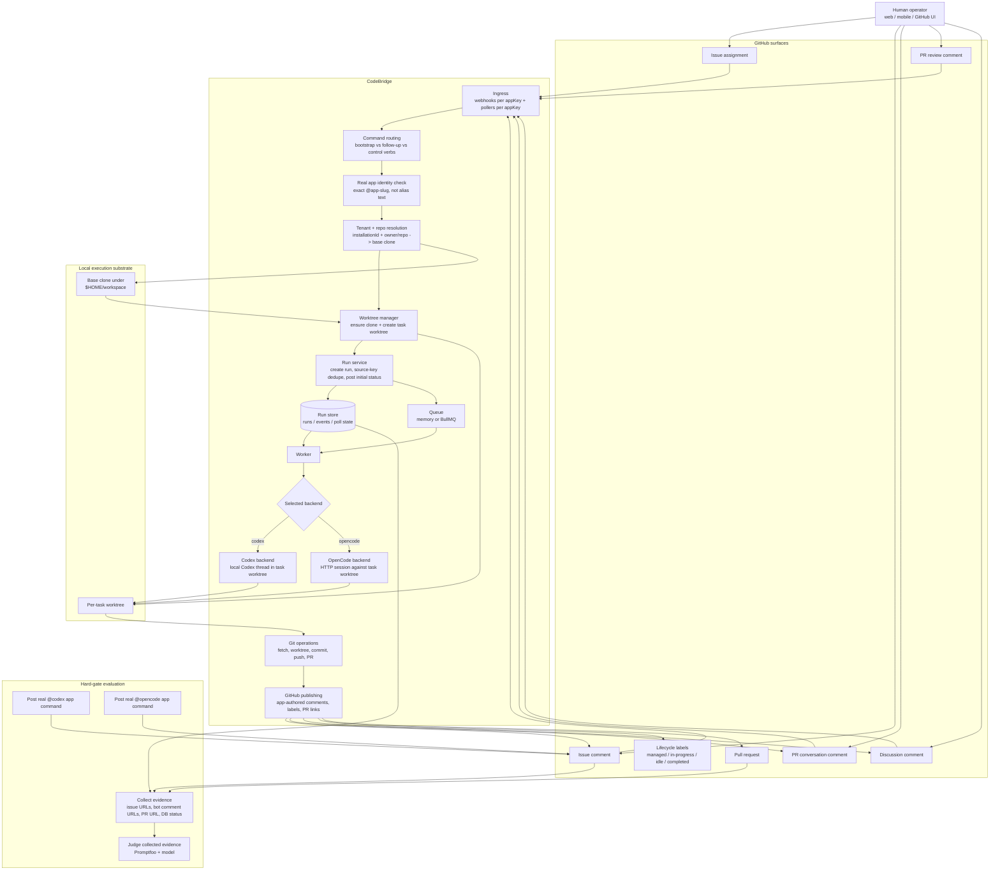
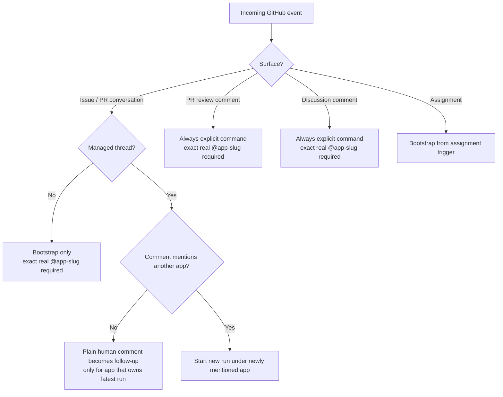

# Current System Understanding

This document separates:

- the target product architecture
- the current implementation shape
- the implementation details that matter for testing and further work

It is not just:

- GitHub comment in
- agent reply out

It is:

- GitHub as the control plane
- local checkout as the execution substrate
- GitHub App identity as the user-visible trust boundary
- CodeBridge as the router, state manager, and publisher
- evaluation as a proof system over real GitHub artifacts

## Target Product Architecture

At the repo lifecycle layer, the intended product architecture is:

```text
GitHub event
  -> resolve owner/repo + app identity
  -> ensure base clone exists under ~/workspace
  -> create isolated per-task worktree
  -> hand that worktree to Codex or OpenCode
  -> publish result back to GitHub as the same app
```

That means the backend should never mutate a long-lived shared checkout directly for GitHub-originated runs.

## Architecture Diagram



## Routing Semantics



## Critical Product Invariants

- GitHub is the control plane, not just a notification sink.
- The GitHub repo itself must be enough to discover or create the local execution substrate.
- GitHub-originated runs should execute in isolated task worktrees, not a shared mutable checkout.
- The app that ingests a command is the same app that must publish status, labels, replies, and PRs.
- Real handle means exact `@<app-slug>` resolved from the GitHub App identity.
- Distinct `appKey` values are not enough; Codex and OpenCode must also have distinct GitHub App identities.
- OpenCode and Codex are backend implementations behind the same run lifecycle, not separate products.
- The hard gate is not satisfied by a success comment. It is satisfied by real GitHub artifacts plus persisted run state plus executable verification.

## Where I Previously Went Wrong

I collapsed two different things into one:

1. product proof
2. operator summary

The operator-authored status comment on `CodeBridge#7` was only a summary.
The actual proof was the app-authored bot comments and PR in `codebridge-test`.

That distinction is part of the product:

- CodeBridge emits app-authored evidence
- humans may summarize that evidence
- summaries are never the same thing as proof

That is the error I made, and it is exactly the kind of bullshit solution you do not want.

## Concrete Repo/Worktree Model

The intended and current GitHub repo lifecycle are now aligned here:

```text
GitHub repo -> ensure clone in ~/workspace -> create task worktree -> run backend there
```

Current implementation details:

- base clone discovery is filesystem-driven under `$HOME/workspace`
- preferred base clone path is `~/workspace/<repo-name>`
- occupied-name fallback path is `~/workspace/<owner>__<repo-name>`
- per-task worktrees live under `~/workspace/.codebridge/worktrees/<owner>__<repo-name>/<run-id>`
- `repos[].path` is optional and only required for non-GitHub entrypoints
- managed-thread relay now reuses the stored run worktree path instead of assuming a fixed configured checkout
